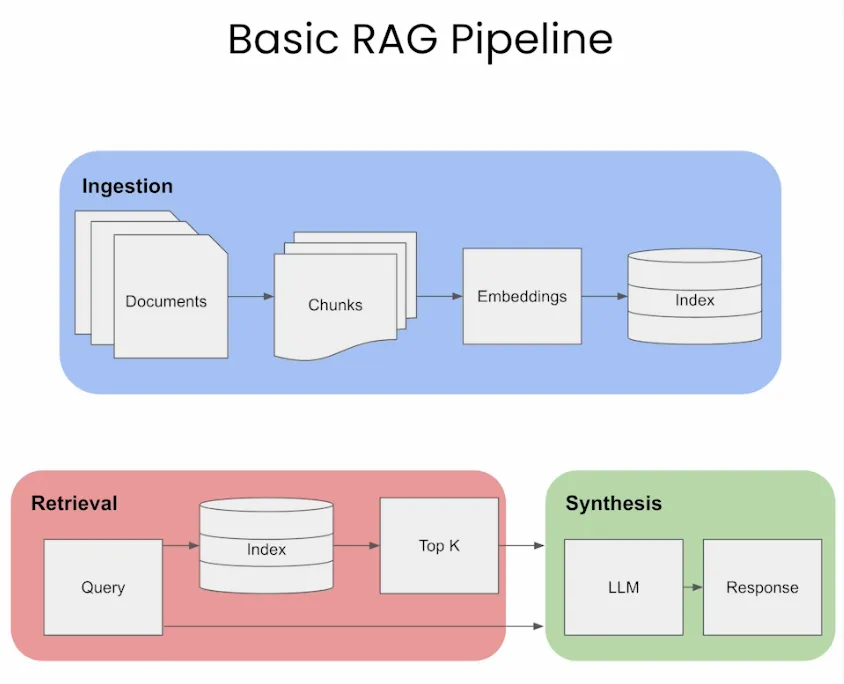
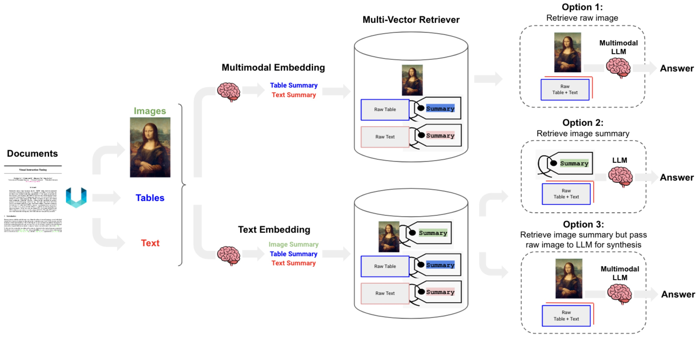

# RAG
In numerous instances, clients possess extensive proprietary documents, such as technical manuals, and require the extraction of specific information from this voluminous content. This task can be likened to locating a needle in a haystack.
Recently, OpenAI introduced a novel model, GPT4-Turbo, which boasts the capability to process large documents, potentially addressing this need. However, this model is not entirely efficient due to the “Lost In The Middle” phenomenon. This phenomenon mirrors the experience where, akin to reading the Bible in its entirety but struggling to recall what follows the Book of Samuel, the model tends to forget content located towards the middle of its contextual window.
To circumvent this limitation, an alternative approach known as Retrieval-Augmented-Generation (RAG) has been developed. This method involves creating an index for every paragraph in the document. When a query is made, the most pertinent paragraphs are swiftly identified and subsequently fed into a Large Language Model (LLM) like GPT4. This strategy of providing only select paragraphs, as opposed to the entire document, prevents information overload within the LLM and significantly enhances the quality of the results.
- Neural Retrieval: Vector emmbedding and Matching using cosine similarity

##### Sentence Transformer
-  Sentence transformers often start with a base model similar to BERT or other transformer architectures. However, the focus is on outputting a single embedding vector for the entire input sentence, rather than individual tokens.

- The “Needle in a Haystack” Test
To understand the in-context retrieval ability of long-context LLMs over various parts of their prompt, a simple ‘needle in a haystack’ analysis could be conducted. This method involves embedding specific, targeted information (the ‘needle’) within a larger, more complex body of text (the ‘haystack’). The purpose is to test the LLM’s ability to identify and utilize this specific piece of information amidst a deluge of other data.

- Graph Database Better than Vecor
  - Graph database: Constructs a knowledge base from extracted entity relationships within the text. This approach is precise but may require exact query matching, which could be restrictive in some applications.
- A potential solution could be to combine the strengths of both databases: indexing parsed entity relationships with vector representations in a graph database for more flexible information retrieval. It remains to be seen if such a hybrid model exists.
- Chunking: Chunk Size 
- Embeddings
  - Sparse embedding: Keyword Mactching, Word2Vec
  - Semantic embedding (contextualized word representations):BERT, Sentence BERT
- Sentence-Window Retrieval / Small-to-Large Chunking: Text around the retrived embedding is also added
- Reranking: Ranking retrived embeddings
- Retrieval-Augmentation (RAG) performance suffers when the relevant information to answer a query is presented in the middle of the context window with strong biases towards the beginning and the end of it.
- Performance decreases with an increase in context length.
- Too many retrieved documents harm performance.
- Improving the retrieval and prompt creation step with a ranking stage could potentially boost performance by up to 20%.
- Metrics to evaluate retrieval: Context Relevance, Context Recall, and Context Precision, which collectively assess the relevance, completeness, and accuracy of the information retrieved in response to a user’s query.
- RAFT, or Retrieval-Augmented Fine-Tuning, is a training approach designed to adapt language models to domain-specific retrieval-augmented generation (RAG) tasks. By removing irrelevent retrived data. To improve accuracy. 

### BERT Embedding
- Series of words
- same length sentence
- [START] [END]
- USing Attention mask when padding is used
- Difference between Question answering and RAG

## To Run
`streamlit run web.py`

## TODO
- Using Custom Embedding
- Using Bigger LLM
- using Graph + vector DB
- Try chunking
- Reranking
- Multimodal RAG

# Reference
- https://vinija.ai/nlp/RAG/#neural-retrieval